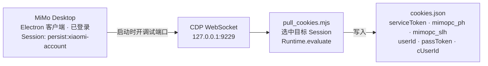
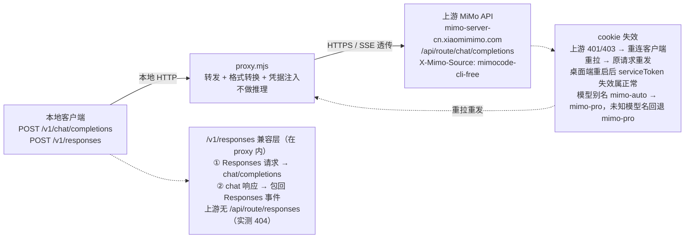

# mimo-desktop-proxy

本项目把 **Xiaomi MiMo Desktop** 的神秘新模型 `mimo-x-preview` 反代成本地 OpenAI 兼容 API

## 原理

**取凭据**

客户端需要带 `--inspect=9229` 启动；cookie 是运行时 session cookie，没有可读的 cookie 文件。

**请求转发**

上游只有 Chat Completions，没有 Responses API（`/api/route/responses` 实测 404）

只做转发和格式转换

## 运行环境

| 项 | 要求 |
|---|---|
| 操作系统 | Windows 10 / 11 |
| Node.js | ≥ 22 |
| MiMo Desktop |  |

## 免责声明

本项目仅用于个人学习、研究 HTTP/API 协议以及本地开发调试。

本项目不是 Xiaomi / MiMo 官方项目，与 Xiaomi、MiMo 或相关服务没有官方合作或授权关系。

使用本项目时，请遵守 MiMo Desktop、Xiaomi Account 以及相关 API 服务的用户协议、服务条款和适用法律法规。

本项目不会提供、破解或绕过账号验证，也不会帮助获取他人的账号凭据。项目需要使用你自己已经登录的 MiMo Desktop 客户端中的运行时 Cookie。

cookies.json 中可能包含能够代表当前登录状态的敏感凭据，请不要将其提交到 Git、上传到公共仓库或分享给他人。如果凭据发生泄露，应及时退出登录或采取其他官方提供的凭据失效措施。

使用本项目产生的任何账号风险、服务限制、封禁、数据损失或其他后果，由使用者自行承担。